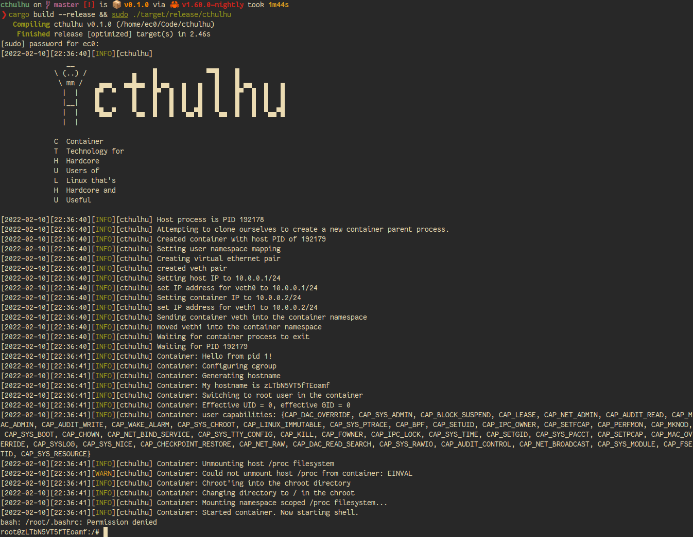

```
   __
\ (..) /           ▄    █            ▀▀█    █
 \ mm /    ▄▄▄   ▄▄█▄▄  █ ▄▄   ▄   ▄   █    █ ▄▄   ▄   ▄
  |  |    █▀  ▀    █    █▀  █  █   █   █    █▀  █  █   █
  |__|    █        █    █   █  █   █   █    █   █  █   █
  |  |    ▀█▄▄▀    ▀▄▄  █   █  ▀▄▄▀█   ▀▄▄  █   █  ▀▄▄▀█
  |  |

C  Container
T  Technology for
H  Hardcore
U  Users of
L  Linux that's
H  Hardcore and
U  Useful

--------------------------------------------------------
```

A very simple tool for starting a shell in a "container".

Demonstration use only.
If you want to use this for anything other than education, I'm not here to judge you.

Designed to demonstrate:

- Linux Namespaces
- CGroups
- Chroot
- Virtual Ethernet devices
- Rust system programming

Running ./cthulhu (as root eeeeeeee) will

- Dial up all the namespaces
- Set up a veth pair with IP 10.0.0.1 (host)
  This part needs some work due to some netlink behaviour I haven't quite had time to work through. 
  You can manually configure an IP in the container, though, and it works.
  Essentially the bindings for netlink need to allow use of the IFLA_NET_NS_PID flag, so that the
  netlink messages can configure the interface inside of the namespace.
  For now, `ip a a dev veth1 10.0.0.2/24` inside the container will do it.
- Mount-namespace (chroot) the contained process to the "chroot" directory in cwd -
  To populate your chroot, run something like `debootstrap bullseye chroot`
  This will be your container filesystem.

To run, after preparing the chroot, run `cargo run`.
All sources are in `src/main.rs`.
Refer to `cthulhu.c` for the original C version.



Happy namespace (ab)use!
